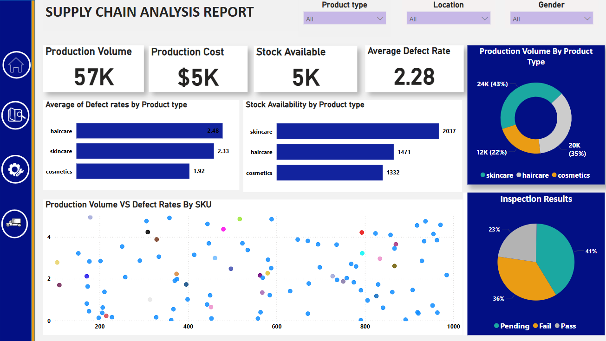

<h1 align="center">🚚📦 From Delay to Delivery: Supply Chain Analytics Dashboard 📈</h1>

---

## 🧠 Overview

This project showcases how business intelligence tools can revolutionize supply chain management. Using Power BI, I analyzed performance metrics across orders, delivery timelines, regions, and customer segments to uncover **where delays happen and how they impact revenue**.

---

## 📊 Live Interactive Dashboard

👉 [Click here to explore the dashboard](https://app.powerbi.com/groups/me/reports/cc762fc0-bbec-4c70-b213-3524121ac1d8/953933c5098e20d60538?experience=power-bi)  
🖥️ *Best viewed on desktop – sign-in required.*

---

## 🎯 Project Objective

This dashboard helps supply chain managers and analysts to:

- 📌 Analyze performance by region, shipment mode, and product category  
- ⏱️ Identify delivery delays and assess cost implications  
- 🚀 Optimize fulfillment timelines and shipping strategies  
- 📈 Empower data-driven decision-making with real-time KPIs

---

## 🔍 Business Questions Answered

- 🚚 Which shipping modes have the longest delivery times?  
- 💸 How do delays impact profit margins?  
- 🌍 Which regions and segments drive the most revenue?  
- 📦 What products are most cost-efficient?

---

## 📂 Dataset Summary

| Feature             | Description                                              |
|---------------------|----------------------------------------------------------|
| `Order ID`          | Unique order identifier                                  |
| `Order Date`        | When the order was placed                                |
| `Ship Mode`         | Type of shipping (Standard, Express, Same-Day, etc.)     |
| `Customer Segment`  | Consumer, Corporate, or Home Office                      |
| `Region`            | Delivery destination region                              |
| `Product Category`  | Category of the ordered product                          |
| `Sales`             | Gross revenue from the order                             |
| `Profit`            | Net profit from the transaction                          |
| `Shipping Cost`     | Delivery expense                                         |
| `Delivery Time`     | Number of days from order to delivery                    |

📌 **Source**: Public dataset (included in repository)

---

## 🖼️ Dashboard Highlights

| Homepage                             | Performance Overview                  |
|-------------------------------------|---------------------------------------|
|     |  |

| Quality & Production                | Shipping Analysis                     |
|-------------------------------------|----------------------------------------|
|  |          |

---

## 💡 Insights Uncovered

- ✅ **Express** deliveries are fastest, but costliest  
- ✅ **West & East** regions are top in profit and fulfillment  
- ✅ **Corporate** customers yield consistent high-value orders  
- ✅ **Technology** products offer best cost-efficiency  
- ✅ Long **delivery times reduce repeat orders**

---

## 🛠️ Tools & Technologies Used

- **Power BI Desktop** – Data visualization  
- **Power Query** – Data cleaning and transformation  
- **DAX** – KPIs and calculated metrics  
- **Excel/CSV** – Dataset structure and manipulation

---

## 🧪 Challenges Tackled

- Standardized inconsistent region names in Power Query  
- Handled missing delivery dates with conditional logic  
- Built dynamic DAX measures for profitability & shipping trends  
- Created optimized drill-downs with minimal performance lag

---

## 💬 Let’s Connect

If you’d like to collaborate, have questions, or want to discuss analytics projects, feel free to reach out!

📧 [muskan.gulati3029@gmail.com](mailto:muskan.gulati3029@gmail.com)  
💼 [linkedin.com/in/muskan-gulati30](https://linkedin.com/in/muskan-gulati30)

---

## 📄 License

This project is licensed under the **MIT License**. You are free to use or adapt it with attribution.

---

> 🔍 *“Good analytics answer questions. Great analytics inspire new ones.”*
