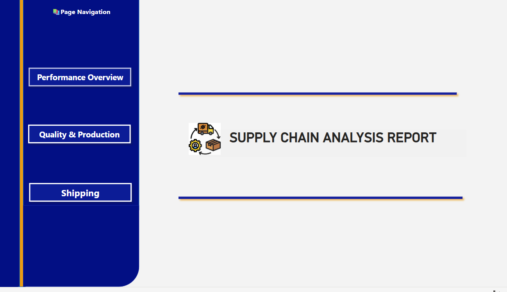
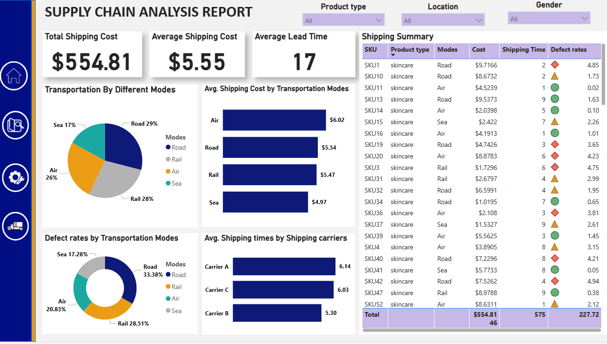

# 🚚 From Delay to Delivery: Supply Chain Analytics Dashboard

An interactive Power BI dashboard that uncovers supply chain inefficiencies—from delayed shipments to lost profits—and transforms them into data-driven opportunities.

---

## 📊 Live Interactive Dashboard

👉 [Click here to view the full dashboard](https://app.powerbi.com/groups/me/reports/cc762fc0-bbec-4c70-b213-3524121ac1d8/953933c5098e20d60538?experience=power-bi)  
_This dashboard is best viewed on desktop._

---

## 🏁 Project Objective

This project aims to:
- Analyze supply chain performance across regions and customer segments
- Identify shipping delays and their financial impact
- Optimize product categories and shipment modes
- Drive decisions using visual and interactive KPIs

---

## 📂 Dataset Features

| Column               | Description                                             |
|----------------------|---------------------------------------------------------|
| `Order ID`           | Unique identifier for each customer order              |
| `Order Date`         | Date when the order was placed                          |
| `Ship Mode`          | Shipping method used (Standard, Express, Same-Day)     |
| `Customer Segment`   | Customer group (e.g., Consumer, Corporate)              |
| `Region`             | Shipping destination                                    |
| `Product Category`   | Product group (e.g., Technology, Furniture)             |
| `Sales`              | Revenue generated per order                             |
| `Profit`             | Net profit from the order                               |
| `Shipping Cost`      | Expense incurred on shipping                            |
| `Delivery Time`      | Number of days taken to deliver                         |

📌 **Source**: Public dataset [You can download from this repository]

---

## 🖼️ Dashboard Screenshots

### 🏠 Homepage

### 📈 Performance Overview

### 🏭 Quality & Production

### 🚛 Shipping Analysis

---

## 🔍 Business Questions Answered

- What are the most delayed shipping modes?
- Which regions yield the most profit?
- How do delivery delays impact revenue?
- Which customer segments are the most cost-effective?
- What product categories contribute most to revenue?

---

## 🧠 Key Insights

✅ Express delivery ensures the fastest shipping but at a higher cost  
✅ West and East regions consistently outperform others in profit and delivery speed  
✅ Corporate clients are the most profitable customer segment  
✅ Technology category shows the highest revenue-to-cost efficiency  
✅ Delivery delays negatively impact repeat orders and profit margins

---

## 🛠️ Tools & Technologies Used

- **Power BI Desktop** – Dashboard & visualization
- **DAX** – Metrics, calculated columns, dynamic KPIs
- **Power Query** – Data transformation
- **Excel/CSV** – Data handling and prep

---

## 🧪 Challenges Faced

- Cleaned inconsistent `Region` values using Power Query  
- Handled null values in delivery and shipment time  
- Designed layered KPIs to support drill-down filters by region and segment  
- Optimized slicers to reduce dashboard load time

---

## 💬 Let’s Connect

If you'd like to collaborate, ask questions about this project, or discuss opportunities, feel free to reach out!

- 📧 **Email**: [muskan.gulati3029@gmail.com](mailto:muskan.gulati3029@gmail.com)  
- 💼 **LinkedIn**: [linkedin.com/in/muskan-gulati30](https://linkedin.com/in/muskan-gulati30)
